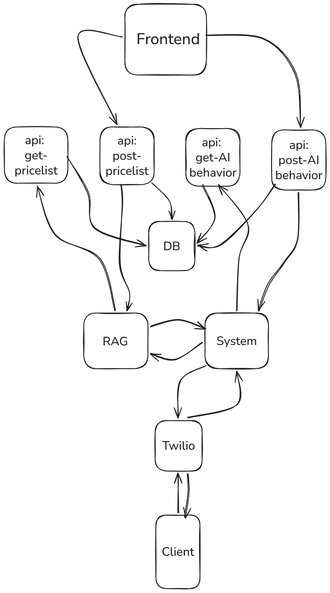

# Mavgoose AI Agent

Mavgoose AI Agent is a voice-based AI system that handles customer phone calls for a mobile repairing store.

The agent answers repair-related questions, sets appointments, transfers calls to a manager when needed, and logs all call details automatically.

## 🚀 Features

* 📞 Handles incoming phone calls
* 🔧 Services:

  * Screen repair
  * Battery replacement
  * Back cover replacement
* 📅 Appointment booking over call
* 🔁 Call transfer to manager
* 📝 Automatic call logging
* 🧠 RAG-based response generation

Voice responses are handled using **Twilio**, which converts AI-generated TwiML (XML) into real audio.

## 🏗️ System Design
<p align="center">
  
</p>

## 🔐 Environment Variables

Create a `.env` file:

```
TWILIO_ACCOUNT_SID=
TWILIO_AUTH_TOKEN=
TWILIO_PHONE_NUMBER=
OPENAI_API_KEY=
API_BASE_URL=
STORE_ID=
ADMIN_EMAIL=
ADMIN_PASSWORD=
STORE_NAME=
PUBLIC_URL=
MANAGER_NUMBER=
```


## 📂 Basic Project Structure

```
mavgoose-ai-agent/
│
├── checker.py
├── main.py
├── rag.py
├── auth.py
├── calllog.json
├── ai_behavior.json
├── conf_twil.py
├── .env
└── requirements.txt
```


## 🎯 Purpose

* Automate customer service for a repair store
* Provide 24/7 AI voice support
* Reduce manual call handling
* Enable phone-based appointment booking
* Allow smart call transfer to manager


